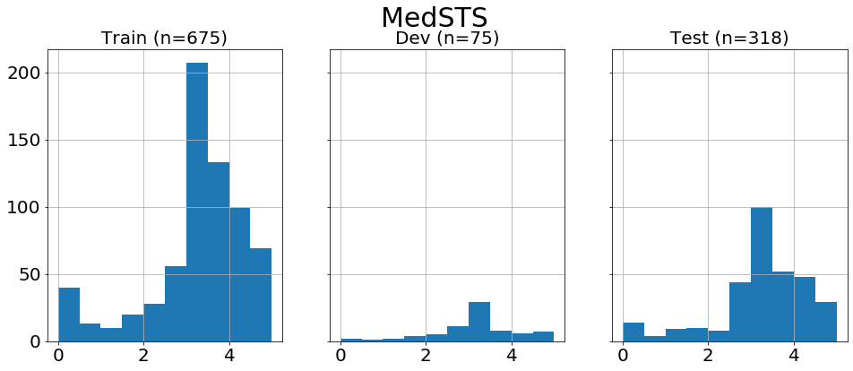

# BLUE Benchmark with Transformers

**\*\*\*\*\* New April 15th, 2020: released \*\*\*\*\***

-----  
Thank you for your interest in our research!  
[Biomedical Language Understanding Evaluation (BLUE) benchmark](https://github.com/ncbi-nlp/BLUE_Benchmark) is a collection of resources for evaluating and analyzing biomedical
natural language representation models ([Peng et al., 2019](#ypeng)).  
This repository provides our implementation of fine-tuning for BLUE benchmark with [🤗Transformers](https://github.com/huggingface/transformers).  
[Our demonstration model](#our-models) is available now.
## Preparations
1. Download the benchmark dataset from https://github.com/ncbi-nlp/BLUE_Benchmark
1. Save  pre-trained models to your directory. For example, [BioBERT](https://github.com/dmis-lab/biobert), [clinicalBERT](https://github.com/EmilyAlsentzer/clinicalBERT), [SciBERT](https://github.com/allenai/scibert), [BlueBERT](https://github.com/ncbi-nlp/bluebert) and so on.
1. Try to use our code in [utils](./utils). Examples of the command can be found in [scripts](./scripts).
### Tips
If you download Tensorflow models, converting them into PyTorch ones comforts your fine-tuning.  
[Converting Tensorflow Checkpoints](https://huggingface.co/transformers/converting_tensorflow_models.html)
```bash
export BERT_BASE_DIR=/path/to/bert/uncased_L-12_H-768_A-12

transformers-cli convert --model_type bert \
  --tf_checkpoint $BERT_BASE_DIR/bert_model.ckpt \
  --config $BERT_BASE_DIR/bert_config.json \
  --pytorch_dump_output $BERT_BASE_DIR/pytorch_model.bin
```
## Our models  
- Demonstration models for our research
  * [BioMed-Base, Uncased, PubMed (demo)](https://github.com/sy-wada/blue_benchmark_with_transformers/releases/tag/v0.1)  #20200415

## Results
|            |**Total**|[MedSTS](#medsts)|[BIOSSES](#biosses)|[BC5CDR disease](#bc5cdr-disease)|[BC5CDR chemical](#bc5cdr-chemical)|[ShARe CLEFE](#shareclefe)|[DDI](#ddi)|[ChemProt](#chemprot)|[i2b2](#i2b2-2010)|[HoC](#hoc)|[MedNLI](#mednli)| 
|:------------------------|-------:|-------:|-------:|-------:|-------:|-------:|-------:|-------:|-------:|-------:|-------:|
| BlueBERT (P)            |  83.0  |**85.3**|  90.8  |  85.6  |  93.3  |  77.6  |  80.5  |  73.5  |**74.2**|  86.2  |  82.7  |
| BioMed (P) demo         |**83.7**|  83.8  |**93.1**|**87.4**|**93.7**|**80.3**|**80.8**|**75.5**|  72.9  |**86.9**|**83.1**|

Table: Test performances of all BERT variants on all tasks and datasets. **Bold** indicates the best result of all.  

**Note**:  
- Due to the size of BIOSSES, the performance is unstable.
  * In addition to epochs and learning rate , we run with different random seeds (n=20) and choose models in the top 50 (top 10%) on the development set.
  * Then, we evaluate the mean of test scores on each model.
  * It is suggested in [Peng et al. (2019)](#ypeng).  

-----  
## Table of Contents
* [Preparations](#preparations)
* [Our models](#our-models)
* [Results](#results)
* [BLUE Tasks](#blue-tasks)
* [Sentence similarity](#sentence-similarity)
  + [MedSTS](#medsts)
  + [BIOSSES](#biosses)
* [Named entity recognition](#named-entity-recognition)
  + [BC5CDR-disease](#bc5cdr-disease)
  + [BC5CDR-chemical](#bc5cdr-chemical)
  + [ShARe/CLEFE](#shareclefe)
* [Relation extraction](#relation-extraction)
  + [DDI](#ddi)
  + [ChemProt](#chemprot)
  + [i2b2 2010](#i2b2-2010)
* [Document multilabel classification](#document-multilabel-classification)
  + [HoC](#hoc)
* [Inference task](#inference-task)
  + [MedNLI](#mednli)
* [Total score](#total-score)
* [Citing](#citing)
* [Acknowledgments](#acknowledgments)
* [References](#references)

## BLUE Tasks
| Corpus          | Train |  Dev | Test | Task                    | Metrics             | Domain     |
|-----------------|------:|-----:|-----:|-------------------------|---------------------|------------|
| MedSTS          |   675 |   75 |  318 | Sentence similarity     | Pearson             | Clinical   |
| BIOSSES         |    64 |   16 |   20 | Sentence similarity     | Pearson             | Biomedical |
| BC5CDR-disease  |  4182 | 4244 | 4424 | Named entity recognition| F1                  | Biomedical |
| BC5CDR-chemical |  5203 | 5347 | 5385 | Named entity recognition| F1                  | Biomedical |
| ShARe/CLEFE     |  4628 | 1065 | 5195 | Named entity recognition| F1                  | Clinical   |
| DDI             |  2937 | 1004 |  979 | Relation extraction     | micro F1            | Biomedical |
| ChemProt        |  4154 | 2416 | 3458 | Relation extraction     | micro F1            | Biomedical |
| i2b2-2010       |  3110 |   11 | 6293 | Relation extraction     | micro F1            | Clinical   |
| HoC             |  1108 |  157 |  315 | Document classification | F1                  | Biomedical |
| MedNLI          | 11232 | 1395 | 1422 | Inference               | accuracy            | Clinical   |


## Sentence similarity
- The sentence similarity task is to predict similarity scores based on sentence pairs.
- **Metrics**: Pearson correlation coefficients
  + We use [scipy.stats.pearsonr()](https://docs.scipy.org/doc/scipy/reference/generated/scipy.stats.pearsonr.html).
### MedSTS
  
[MedSTS](https://mayoclinic.pure.elsevier.com/en/publications/medsts-a-resource-for-clinical-semantic-textual-similarity) is a corpus of sentence pairs selected from Mayo Clinics clinical data warehouse and was used in the BioCreative/OHNLP Challenge 2018 Task 2 ([Wang et al., 2018](#ywang), also called [ClinicalSTS](https://sites.google.com/view/ohnlp2018/home)).  
Please visit the website or contact to the 1st author to obtain a copy of the dataset.
### BIOSSES
  
[BIOSSES](https://tabilab.cmpe.boun.edu.tr/BIOSSES/) is a corpus of sentence pairs selected from the Biomedical Summarization Track Training Dataset in the biomedical domain ([Soğancıoğlu et al., 2017](#gsogancioglu)).  
#### Known problems
The BIOSSES dataset is very small (only 16 sentence pairs in the development set). It causes unstable performance of fine-tuning, so in addition to epochs and learning rate, we try multiple random seeds (n=20) and adopt models in the top 50 (top 10%) on the development set.  
Then, we evaluate the mean of test scores on each model.  
## Named entity recognition
- The aim of the named entity recognition task is to predict mention spans given in the text.
- **Metrics**: strict version of F1-score (exact phrase matching).
  + We use a primitive approach descirbed below to deal with disjoint mentions.
### Known problems
There are some irregular patterns:
- **starting with I**: caused by long phrases split in the middle [(example)](#startingwithi).
- **I next to O**: due to discontinuous mentions. It is often observed in [ShARe/CLEFE](#shareclefe) [(example)](#inexttoo).  

[conlleval.py](https://github.com/ncbi-nlp/bluebert/blob/master/bluebert/conlleval.py) appears to count them as different phrases.  
Then, we manage this problem by the following method on evaluation:  
1. Example:  

| index | 0 | 1 | 2 | 3 | 4 | 5 | 6 | 7 | 8 | 9 | 10| 11| 12| 13| 14| 15| 16| 17| 18| 19|
|------:|:-:|:-:|:-:|:-:|:-:|:-:|:-:|:-:|:-:|:-:|:-:|:-:|:-:|:-:|:-:|:-:|:-:|:-:|:-:|:-:|
| y_true| O | O | B | I | O |   | O | B | I | O | I | O |   | B | I | I |   | I | I | O |
| y_pred| O | O | B | I | O |   | O | B | I | O | O | O |   | B | I | I |   | I | O | I |

2. skip blank line and concat all the tags in the sentence into a one-dimensional array.  

| index | 0 | 1 | 2 | 3 | 4 | 6 | 7 | 8 | 9 | 10| 11| 13| 14| 15| 17| 18| 19|
|------:|:-:|:-:|:-:|:-:|:-:|:-:|:-:|:-:|:-:|:-:|:-:|:-:|:-:|:-:|:-:|:-:|:-:|
| y_true| O | O | B | I | O | O | B | I | O | I | O | B | I | I | I | I | O |
| y_pred| O | O | B | I | O | O | B | I | O | O | O | B | I | I | I | O | I |

3. get the token index of phrases that start with B.  
- **y_true**: 2_3, 7_8_10, 13_14_15_17_18
- **y_pred**: 2_3, 7_8, 13_14_15_17_19

4. calculate metrics: [utils/metrics/ner.py](https://github.com/sy-wada/blue_benchmark_with_transformers/blob/c9dbdea715f6ecec9da2988d3abb80370d9eb271/utils/metrics/ner.py#L33-L41)  
```python
y_true = set(y_true))
y_pred = set(y_pred))

TP = len(y_true & y_pred)           # 1: (2_3)
FN = len(y_true) - TP               # 2: (7_8_10, 13_14_15_17_18)
FP = len(y_pred) - TP               # 2: (7_8, 13_14_15_17_19)
prec = TP / (TP + FP)               # 1 / (1 + 2) = 0.33
rec = TP / (TP + FN)                # 1 / (1 + 2) = 0.33
fb1 = 2 * rec * prec / (rec + prec) # = 0.33
```

 


### BC5CDR-disease
|tag of tokens   | Train |  Dev |  Test |
|----------------|------:|-----:|------:|
|starting with B |  4182 | 4244 |  4424 |
|starting with I |     0 |    0 |     0 |
|I next to O     |     0 |    0 |     0 |
|**Total**       |  4182 | 4244 |  4424 |

[BC5CDR](https://biocreative.bioinformatics.udel.edu/tasks/biocreative-v/track-3-cdr/) is a collection of 1,500 PubMed titles and abstracts selected from the CTD-Pfizer corpus and was used in the BioCreative V chemical-disease relation task ([Li et al., 2016](#jli)).
### BC5CDR-chemical
|tag of tokens   | Train |  Dev |  Test |
|----------------|------:|-----:|------:|
|starting with B |  5203 | 5347 |  5385 |
|starting with I |     2 |    0 |     1 |
|I next to O     |     0 |    0 |     0 |
|**Total**       |  5205 | 5347 |  5386 |

An example of *starting with I*: `test.tsv#L78550-L78598`<a id="startingwithi"></a>
```
  
Compound	10510854	553	O  
7e	-	562	O  
,	-	564	O  
5	-	566	B  
-	-	567	I  
{	-	568	I  
2	-	569	I  
-	-	570	I  
// -------------
1H	-	637	I  
-	-	639	I  
  
indol	10510854	641	I  
-	-	646	I  
2	-	647	I  
-	-	648	I  
one	-	649	I  
,	-	652	O  
// -------------
```

### ShARe/CLEFE
|tag of tokens   | Train |  Dev |  Test |
|----------------|------:|-----:|------:|
|starting with B |  4628 | 1065 |  5195 |
|starting with I |     6 |    1 |    17 |
|I next to O     |   517 |  110 |   411 |
|**Total**       |  5151 | 1176 |  5623 |

[ShARe/CLEFE](https://physionet.org/content/shareclefehealth2013/1.0/) eHealth Task 1 Corpus is a collection of 299 deidentified clinical free-text notes from the MIMIC II database ([Suominen et al.,2013](#hsuominen)).  
Please visit the website and sign up to obtain a copy of the dataset.  
An example of *I next to O*: `Test.tsv#L112-L118`<a id="inexttoo"></a>  
You'd better check out these original files, too: 
- `Task1Gold_SN2012/Gold_SN2012/00176-102920-ECHO_REPORT.txt#L2`
- `Task1TestSetCorpus100/ALLREPORTS/00176-102920-ECHO_REPORT.txt#L21`
```
The	00176-102920-ECHO_REPORT	426	O
left	-	430	B
atrium	-	435	I
is	-	442	O
moderately	-	445	O
dilated	-	456	I
.	-	463	O
```

## Relation extraction
- The aim of the relation extraction task is to predict relations and their types between the two entities mentioned in the sentences. The relations with types were compared to annotated data.
- Following the implimentation of [BLUE benchmark](https://github.com/ncbi-nlp/BLUE_Benchmark), we treated the relation extraction task as a sentence classification by replacing two named entity mentions of interest in the sentence with predefined tags ([Lee et al., 2019](#jlee)).
  + **ORIGINAL**: *Citalopram* protected against the RTI-76-induced inhibition of *SERT* binding.
  + **REPLACED**: *@CHEMICAL$* protected against the RTI-76-induced inhibition of *@GENE$* binding.
  + **RELATION**: *citalopram* and *SERT* has **a chemical-gene relation**.
- **Evaluation**:
  1. predict classes containing "false".
  1. aggregate TP, FN, and FP in each class.
  1. calculate metrics excluding the "false" class.
- **Metrics**: micro-average F1-score.
  + We use [sklearn.metrics.confusion_matrix()](https://scikit-learn.org/stable/modules/generated/sklearn.metrics.confusion_matrix.html) and compute TP, FP, FN and TN on each class.

### DDI
| class        | Train |  Dev |  Test | note |
|--------------|------:|-----:|------:|:-----|
|DDI-advise    |   633 |  193 |   221 | a recommendation or advice regarding a drug interaction is given.<br>e.g. *UROXATRAL should not be used in combination with other alpha-blockers*. |
|DDI-effect    |  1212 |  396 |   360 | DDIs describing an effect or a pharmacodynamic (PD) mechanism.<br>e.g. *In uninfected volunteers, 46% developed rash while receiving SUSTIVA and clarithromycin. <br> Chlorthalidone may potentiate the action of other antihypertensive drugs.* | 
|DDI-int       |   146 |   42 |    96 | a DDI appears in the text without providing any additional information. <br>e.g. *The interaction of omeprazole and ketoconazole has been established.* |
|DDI-mechanism |   946 |  373 |   302 | drug-drug interactions (DDIs) described by their pharmacokinetic (PK) mechanism. <br>e.g. *Grepafloxacin may inhibit the metabolism of theobromine.* |
|DDI-false     | 15842 | 6240 |  4782 | |
|**Total**     |  2937<br>+15842| 1004<br>+6240 |  979<br>+4782 | |

[DDI](http://labda.inf.uc3m.es/ddicorpus) extraction 2013 corpus is a collection of 792 texts selected from the DrugBank database and other 233 Medline abstracts ([Herrero-Zazo et al., 2013](#hzazo)).

### ChemProt
| class | Train |  Dev |  Test | note |
|-------|------:|-----:|------:|:-----|
|CPR:3  |   768 |  550 |   665 | UPREGULATOR\|ACTIVATOR\|INDIRECT_UPREGULATOR |
|CPR:4  |  2251 | 1094 |  1661 | DOWNREGULATOR\|INHIBITOR\|INDIRECT_DOWNREGULATOR |
|CPR:5  |   173 |  116 |   195 | AGONIST\|AGONIST-ACTIVATOR\|AGONIST-INHIBITOR |
|CPR:6  |   235 |  199 |   293 | ANTAGONIST |
|CPR:9  |   727 |  457 |   644 | SUBSTRATE\|PRODUCT_OF\|SUBSTRATE_PRODUCT_OF |
|false  | 15306 | 9404 | 13485 | |
|**Total**|  4154<br>+15306| 2416<br>+9404 |  3458<br>+13485 |

[ChemProt](https://biocreative.bioinformatics.udel.edu/news/corpora/) consists of 1,820 PubMed abstracts with chemical-protein interactions and was used in the BioCreative VI text mining chemical-protein interactions shared task ([Krallinger et al, 2017](#mkrallinger)).

### i2b2 2010
| class | Train |  Dev |  Test | note |
|-------|------:|-----:|------:|:-----|
|PIP    |   755 |    0 |  1448 | Medical problem indicates medical problem. |
|TeCP   |   158 |    8 |   338 | Test conducted to investigate medical problem. |
|TeRP   |   993 |    0 |  2060 | Test reveals medical problem. |
|TrAP   |   883 |    2 |  1732 | Treatment is administered for medical problem. |
|TrCP   |   184 |    0 |   342 | Treatment causes medical problem. |
|TrIP   |    51 |    0 |   152 | Treatment improves medical problem. |
|TrNAP  |    62 |    0 |   112 | Treatment is not administered because of medical problem. |
|TrWP   |    24 |    0 |   109 | Treatment worsens medical problem. |
|false  | 19050 |   86 | 36707 | They are in the same sentence, but do not fit into one of the above defined relationships. |
|**Total**|  3110<br>+19050| 10<br>+86 |  6293<br>+36707 | |

[i2b2 2010](https://www.i2b2.org/NLP/DataSets/) shared task collection consists of 170 documents for training and 256 documents for testing, which is the subset of the original dataset ([Uzuner et al., 2011](#ouzuner)).

#### Known problems
The development dataset is very small, so it is a difficult to determine the best model.  
## Document multilabel classification
- The multilabel classification task predicts multiple labels from the texts.

### HoC
| label | Train |  Dev |  Test |
|-------|------:|-----:|------:|
|0      |   458 |   71 |   138 |
|1      |   148 |   33 |    45 |
|2      |   164 |   14 |    35 |
|3      |   213 |   30 |    52 |
|4      |   264 |   34 |    70 |
|5      |   563 |   58 |   150 |
|6      |   238 |   39 |    80 |
|7      |   596 |   92 |   145 |
|8      |   723 |   86 |   184 |
|9      |   346 |   55 |   119 |

**Labels**: ***(IM)** Activating invasion & metastasis, **(ID)** Avoiding immune destruction, **(CE)** Deregulating cellular energetics,
**(RI)** Enabling replicative immortality, **(GS)** Evading growth suppressors, **(GI)** Genome instability & mutation,
**(A)** Inducing angiogenesis, **(CD)** Resisting cell death, **(PS)** Sustaining proliferative signaling, **(TPI)** tumor promoting inflammation*  
**Note**: This table shows the number of each label on the sentence level, rather than on the abstract level.  
- **Train**: sentences: 10527/ articles: 1108
- **Dev**:   sentences:  1496/ articles:  157
- **Test**:  sentences:  2896/ articles:  315

[HoC](https://github.com/sb895/Hallmarks-of-Cancer) (the Hallmarks of Cancers corpus) consists of 1,580 PubMed publication abstracts manually annotated with ten currently known hallmarks of cancer([Baker et al., 2016](#sbaker)).
- **Evaluation**:
  1. predict multi-labels for each sentence in the document.
  1. combine the labels in one document and compare them with the gold-standard.
- **Metrics**: example-based F1-score on the abstract level ([Zhang and Zhou, 2014](#zz); [Du et al., 2019](#jdu)).
  + We use [eval_hoc.py](https://github.com/ncbi-nlp/BLUE_Benchmark/blob/master/blue/eval_hoc.py) from [the BLUE benchmark repository](https://github.com/ncbi-nlp/BLUE_Benchmark) to calculate the metrics.

## Inference task
- The aim of the inference task is to predict whether the premise sentence entails or contradicts the hypothesis sentence.
- **Metrics**: overall accuracy
  + We use [sklearn.metrics.confusion_matrix()](https://scikit-learn.org/stable/modules/generated/sklearn.metrics.confusion_matrix.html) and [sklearn.metrics.accuracy_score()](https://scikit-learn.org/stable/modules/generated/sklearn.metrics.accuracy_score.html) to compute TP, FP, FN and TN on each class and overall accuracy.

### MedNLI
| class        | Train |  Dev |  Test |
|--------------|------:|-----:|------:|
|contradiction |  3744 |  465 |   474 |
|entailment    |  3744 |  465 |   474 |
|neutral       |  3744 |  465 |   474 |
|**Total**     | 11232 | 1395 |  1422 |

[MedNLI](https://physionet.org/content/mednli/1.0.0/) is a collection of sentence pairs selected from MIMIC-III ([Romanov and Shivade, 2018](#aromanov)).  
Please visit the website and sign up to obtain a copy of the dataset.  

## Total score
Following the practice in  [Peng et al. (2019)](#ypeng), we use a macro-average of Pearson scores, F1-scores and an overall accuracy score to determine a pre-trained model's position.  
The results are [above](#results).

## Citing
If you use our work in your research, please kindly cite the following papers:  
`the original paper of BLUE Benchmark`  
- Peng Y, Yan S, Lu Z. Transfer Learning in Biomedical Natural Language Processing: An Evaluation of BERT and ELMo on Ten Benchmarking Datasets. In Proceedings of the 2019 Workshop on Biomedical Natural Language Processing (BioNLP 2019). 2019:58-65.

`Our research`  
- currently being prepared.
## Acknowledgments
We are grateful to the authors of BERT to make the data and codes publicly available. We thank the NVIDIA team because their implimentation of [BERT for PyTorch](https://github.com/NVIDIA/DeepLearningExamples/tree/master/PyTorch/LanguageModeling/BERT) enables us to pre-train BERT models on our local machine. We would also like to take this opportunity to thank Yifan Peng and shared task organizers for publishing BLUE benchmark.  
This work was supported by Council for Science, Technology and Innovation (CSTI), cross-ministerial Strategic Innovation Promotion Program (SIP), "Innovative AI Hospital System" (Funding Agency: National Instisute of Biomedical Innovation, Health and Nutrition (NIBIOHN)).

## References
- <a id="ypeng"></a>Peng Y, Yan S, Lu Z. [Transfer Learning in Biomedical Natural Language Processing: An
Evaluation of BERT and ELMo on Ten Benchmarking Datasets](https://www.aclweb.org/anthology/W19-5006/). In *Proceedings of the Workshop on Biomedical Natural Language Processing (BioNLP)*. 2019: 58-65.
- <a id="ywang"></a>Wang Y, Afzal N, Fu S, Wang L, Shen F, Rastegar-Mojarad M, Liu H. [MedSTS: a resource for clinical semantic textual similarity](https://link.springer.com/article/10.1007/s10579-018-9431-1). *Language Resources and Evaluation*. 2018 Jan 1:1-6.
- <a id="gsogancioglu"></a>Soğancıoğlu G, Öztürk H, Özgü A. [BIOSSES: a semantic sentence similarity estimation system for the biomedical domain](https://www.ncbi.nlm.nih.gov/pubmed/28881973). *Bioinformatics*. 2017 Jul 15; 33(14): i49–i58.
- <a id="jli"></a>Li J, Sun Y, Johnson RJ, Sciaky D, Wei CH, Leaman R, Davis AP, et al.. [BioCreative V CDR task corpus: a resource for chemical disease relation extraction](https://academic.oup.com/database/article/doi/10.1093/database/baw068/2630414). *Database: the journal of biological databases and curation*. 2016.
- <a id="hsuominen"></a>Suominen H, Salanterä S, Velupillai S, Chapman WW, Savova G, Elhadad N, Pradhan S, et al.. [Overview of the ShARe/CLEF eHealth evaluation lab 2013](https://link.springer.com/chapter/10.1007%2F978-3-642-40802-1_24). *Information Access Evaluation Multilinguality, Multimodality, and Visualization*. 2013. Springer. 212–231.
- <a id="jlee"></a>Lee J, Yoon W, Kim S, Kim D, Kim S, So CH, et al. [BioBERT: a pre-trained biomedical language representation model for biomedical text mining](https://www.ncbi.nlm.nih.gov/pubmed/31501885). 2019;36(4):1234-40.
- <a id="hzazo"></a>Herrero-Zazo M, Segura-Bedmar I, Martínez P, Declerck T. [The DDI corpus: an annotated corpus with pharmacological substances and drug-drug interactions](https://www.ncbi.nlm.nih.gov/pubmed/23906817). *Journal of biomedical informatics*. 2013 46: 914–920.
- <a id="mkrallinger"></a>Krallinger M, Rabal O, Akhondi SA, Pérez MP, Santamaría JL, Rodríguez GP, Tsatsaronis G, et al.. [Overview of the BioCreative VI chemical-protein interaction track](https://biocreative.bioinformatics.udel.edu/tasks/biocreative-vi/track-5/). In Proceedings of *BioCreative*. 2017. 141–146.
- <a id="ouzuner"></a>Uzuner Ö,South BR,Shen S, DuVall SL. [2010 i2b2/va challenge on concepts, assertions, and relations in clinical text](https://www.ncbi.nlm.nih.gov/pmc/articles/PMC3168320/). *Journal of the American Medical Informatics Association (JAMIA)*. 2011 18: 552–556.
- <a id="sbaker"></a>Baker S, Silins I, Guo Y, Ali I, Högberg J, Stenius U, Korhonen A. [Automatic semantic classification of scientific literature according to the hallmarks of cancer](https://www.ncbi.nlm.nih.gov/pubmed/26454282). *Bioinformatics (Oxford, England)*. 2016 32: 432–440.
- <a id="zz"></a>Zhang ML, Zhou ZH. [A review on multi-label learning algorithms](https://ieeexplore.ieee.org/document/6471714). *IEEE Transactions on Knowledge and Data Engineering*. 2014 26(8): 1819–1837.
- <a id="jdu"></a>Du J, Chen Q, Peng Y, Xiang Y, Tao C, Lu Z. [ML-Net: multilabel classification of biomedical texts with deep neural networks](https://academic.oup.com/jamia/article/26/11/1279/5522430). *Journal of the American Medical Informatics Association (JAMIA)*. 2019 Nov; 26(11); 1279–1285.
- <a id="aromanov"></a>Romanov A, Shivade C. [Lessons from Natural Language Inference in the Clinical Domain](https://www.aclweb.org/anthology/D18-1187/). In *Proceedings of the 2018 Conference on Empirical Methods in Natural Language Processing*. 2018: 1586-1596.
